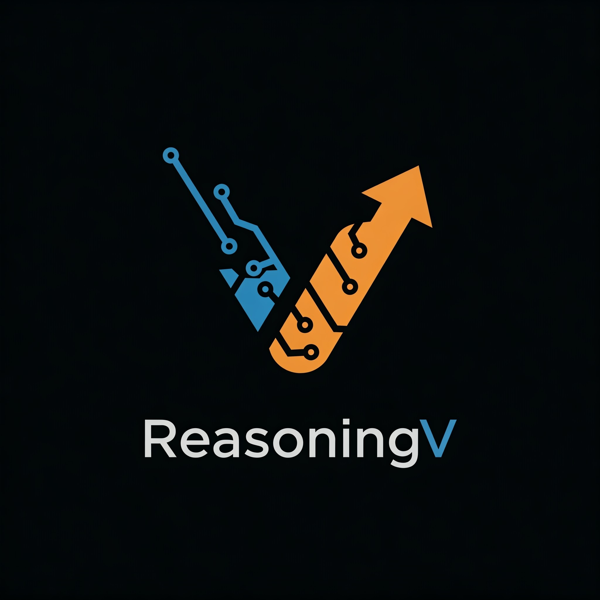

<div align="center">
   <div>&nbsp;</div>
  <h1>ReasoningV: 高效 Verilog 代码生成与自适应混合推理模型</h1>
  <div>&nbsp;</div>

  [English](README.md) | 简体中文

  <div>&nbsp;</div>

  [🤗 Hugging Face 数据集](https://huggingface.co/datasets/hyq001/ReasoningV-5K) | [🤗 Hugging Face 模型](https://huggingface.co/hyq001/ReasoninV) | [🌐 GitHub 仓库](https://github.com/BUAA-CLab/ReasoningV) | [📄 论文](https://arxiv.org/pdf/2504.14560v3)

  <div>&nbsp;</div>

  [-ReasoningV--5K-blue?link=https://huggingface.co/datasets/hyq001/ReasoningV-5K)](https://huggingface.co/datasets/hyq001/ReasoningV-5K)
  [-ReasoningV-blue?link=https://huggingface.co/hyq001/ReasoninV)](https://huggingface.co/hyq001/ReasoninV)
  [](https://github.com/BUAA-CLab/ReasoningV)
  [](https://github.com/BUAA-CLab/ReasoningV/blob/main/LICENSE) [](https://www.python.org/) <div>&nbsp;</div>

  [📚 GitHub 仓库](https://github.com/BUAA-CLab/ReasoningV) |
  [📄 论文](https://arxiv.org/pdf/2504.14560v3) |
  [🐛 报告问题](https://github.com/BUAA-CLab/ReasoningV/issues/new/choose)

</div>

-----

## 目录

* [引言](#introduction)
* [开源计划](#open-source-plan)
* [引用](#citation)
* [许可证](#license)

-----
<div id="introduction"></div>

## 引言

ReasoningV 是一个旨在通过解决大型语言模型 (LLM) 在 Verilog 代码生成中面临的关键挑战（包括数据质量限制、复杂硬件任务推理能力不足和计算效率低下）来增强其能力的新颖模型。我们提出了**混合推理策略**，该策略集成了经过训练的内在能力与动态推理适应性。

我们的工作引入了三项互补创新：

1.  **ReasoningV-5K 数据集:** 一个包含超过 5000 个功能已验证并带有推理路径的高质量 Verilog 数据集。
2.  **两阶段训练:** 一种结合参数高效微调以构建基础知识和全参数优化以增强推理能力的训练方法。
3.  **自适应推理机制:** 根据问题复杂度动态调整推理深度，以提高效率（减少 token 消耗）同时保持性能。

实验结果表明，ReasoningV 效果显著，在 Verilog 基准测试上取得了与领先模型相比具有竞争力的性能，尤其在开源模型中脱颖而出。这项工作旨在为推动 AI 驱动的硬件设计自动化提供更可靠、更易于访问的途径。

-----
<div id="open-source-plan"></div>

## 开源计划

我们致力于开源 ReasoningV 项目的关键组件，以促进 AI 驱动的硬件设计领域的研究和开发。

我们计划发布以下内容：

- [ ] **ReasoningV-5K 数据集:** 高质量、功能已验证的数据集（[Hugging Face 链接](https://huggingface.co/datasets/hyq001/ReasoningV-5K)）。
- [ ] **ReasoningV 模型权重:** 预训练模型权重（[Hugging Face 链接](https://huggingface.co/hyq001/ReasoninV)）。
- [ ] **两阶段训练代码:** 我们提出的训练方法的代码实现。

**发布策略:**

我们将在论文被正式接收发表后，陆续开源训练代码及其他相关资源。敬请关注！

-----
<div id="citation"></div>

## 引用

如果这项工作对你的研究有所帮助，请考虑引用我们的论文：

```bibtex
@article{qin2025reasoningv,
  title={ReasoningV: Efficient Verilog Code Generation with Adaptive Hybrid Reasoning Model},
  author={Qin, Haiyan and Xie, Zhiwei and Li, Jingjing and Li, LiangChen and Feng, Xiaotong and Liu, Junzhan and Kang, Wang},
  journal={arXiv preprint arXiv:2504.14560},
  year={2025}
}
```


## 许可证

本项目采用 Apache License 2.0 许可证 - 详情请见 [LICENSE](https://www.google.com/url?sa=E&source=gmail&q=https://github.com/BUAA-CLab/ReasoningV/blob/main/LICENSE) 文件。 

